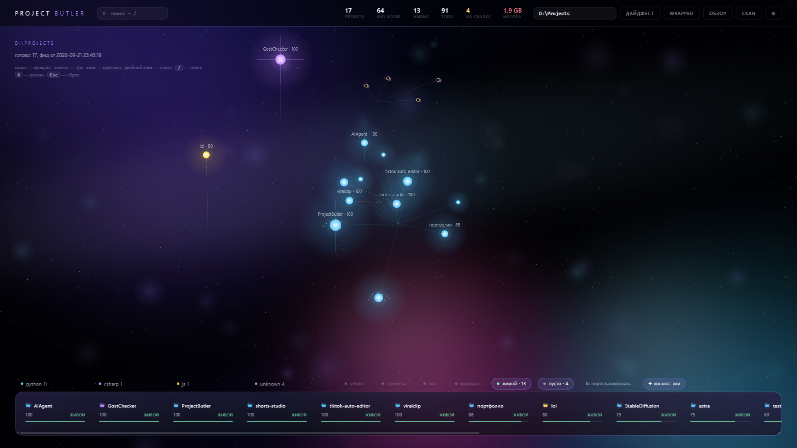
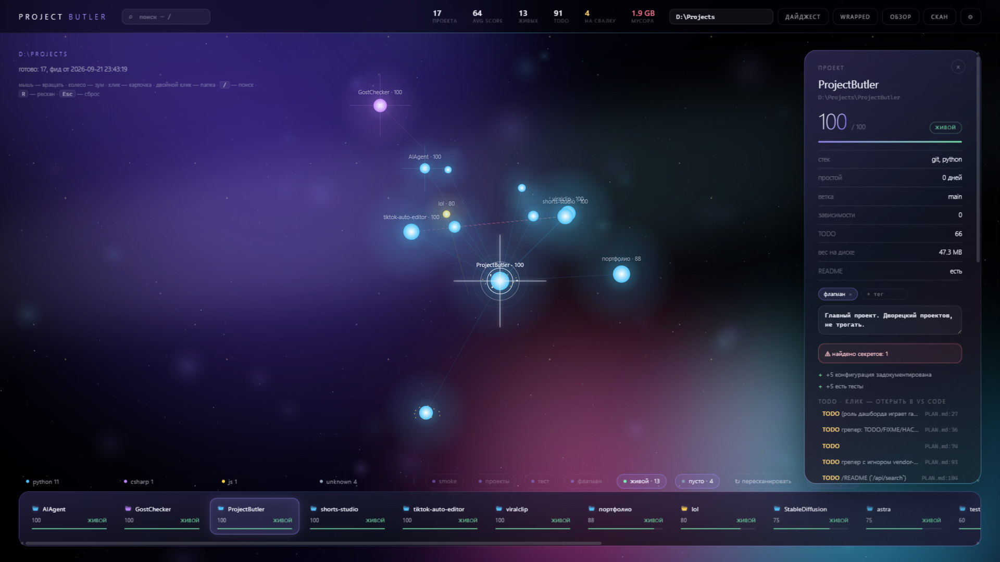
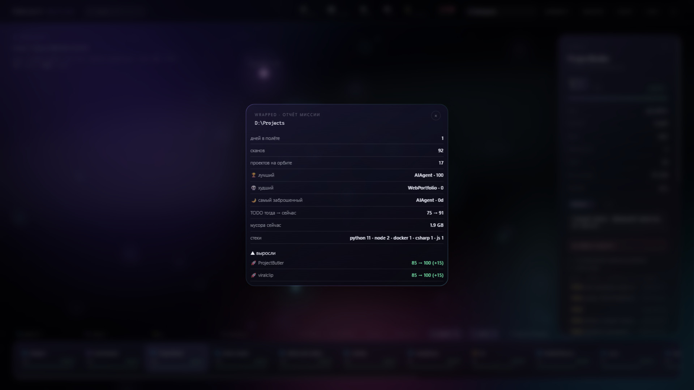
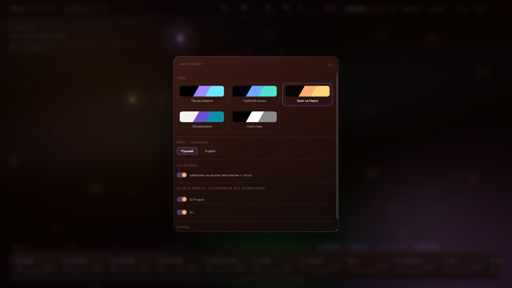

# Project Butler

[](#тесты)
[](https://www.python.org/)
[](#как-поставить)
[](#как-поставить)

**Локальный дворецкий твоих проектов.** Сканит папку с проектами, считает здоровье (0–100),
находит TODO и утёкшие секреты, воскрешает мёртвые окружения, публикует на GitHub
и рисует всё это **галактикой** в браузере. Python 3.12, ноль зависимостей,
всё локально — ничего не улетает в облако.



Локальный пилот по папке с проектами. Видит все проекты, считает здоровье (0–100),
находит TODO и чтение env в коде, отдаёт всё через CLI, MCP и «галактику проектов»
в браузере. **Ноль зависимостей** — только стандартная библиотека Python 3.12.
Всё локально, ничего в облако не отправляет. Windows-first.

## Как это выглядит

| Галактика | Карточка проекта |
|---|---|
|  |  |
| **Wrapped — отчёт миссии** | **Настройки: темы и язык** |
|  |  |

Каждая звезда — проект: светлость = health-score, цвет = стек, чёрные дыры = мёртвые,
янтарные рои = TODO. Кластеры по стекам, ринги тревоги вокруг заброшенных,
пунктир между близнецами-дубликатами.

## Возможности

| Фича | Что делает |
|---|---|
| Сканер | обход папки, детекторы python / node / csharp / go / docker / git, вложенные корни |
| Health-score | штрафы (нет README / нет git / env без `.env.example` / протухшие зависимости / не установлено) и бонусы (тесты, CI, lock) |
| Статусы | `alive` / `abandoned` (>180 дней) / `broken` (<40 баллов) / `unknown` (пусто) |
| TODO-грепер | TODO/FIXME/HACK/XXX/BUG с файлом и строкой, с игнором `node_modules`, `.venv` и т.д. |
| Диск | вес проектов и мусорных директорий (node_modules/.venv/…), кнопка «снести» в UI |
| Дубликаты | Жаккар-схожесть по зависимостям/README/структуре, розовые пунктирные рёбра в галактике |
| Секреты | токены ботов, ключи OpenAI/Google/AWS и пароли в коде, замаскированные превью; `.env` вне `.gitignore` |
| Доктор | диагностика: git/python/node/docker, venv, `pip check`, `npm ls`, uncommitted, ahead/behind, docker compose config, node vs engines, pip/npm outdated — только чтение; таймауты — мягкий «◐» |
| История | каждый скан пишет снапшот score; в карточке спарклайн, `butler diff` — что изменилось |
| Галактика | браузерный 3D-визуал: кластеры по стеку, свечение по score, ринг — по статусу; клик открывает папку |
| Пикер папок | «обзор» в UI: дерево дисков и подпапок (`/api/browse`), скрытые/системные папки отфильтрованы, скан выбранной в один клик |
| Теги и заметки | свои теги и заметка на проект в карточке, фильтр галактики по тегу, хранятся в sqlite, MCP-инструмент `butler_tags` |
| Воскрешение | «Воскресить»: `.venv` / `npm install` в песочнице проекта + генерация `.env.example` из чтений env в коде; код не трогается |
| Запуск в один клик | «Запустить»: авто-детект команды (`npm start`, `py main.py`, `go run .`), лог в карточке, кнопка «Остановить» |
| Дайджест | панель «что изменилось с прошлого скана»: кто родился/ушёл, рост и падение score |
| Живой фид | UI следит за версией фида: скан в другом окне или CLI — галактика обновляется сама |
| Поиск по содержимому | `/` — поиск не только по имени, но и по зависимостям, README и TODO-текстам (`/api/search`), несовпадающие звёзды затмеваются |
| TODO → код | список TODO в карточке, клик открывает VS Code на нужной строке (`vscode://file/...:line`) |
| Git-пульс | коммиты за 30 дней столбиками в карточке (`/api/gitpulse`) |
| Wrapped | «отчёт миссии»: дни в полёте, лучший/худший, кто вырос и кто просял за всю историю сканов |
| Watch-сервер | тумблер в настройках: поллинг диска раз в 90с, авто-рескан и тосты Windows при изменениях |
| Мульти-корень | галактика из нескольких папок: отмечаешь корни в настройках, скан объединяет всё в один фид |
| GitHub | вход по Personal Access Token (проверка через /user), публикация проектов (создание репо + push), приватность, описание, issues/wiki, релизы с тегами — всё из карточки |
| Настройки | темы «Тёмная материя / Глубокий космос / Закат на Марсе / Обсерватория» + свой стиль (4 цвета), язык RU/EN, вход в GitHub; хранятся в ~/.project-butler/settings.json |
| MCP-сервер | 14 инструментов для Claude / Cline по stdio (без SDK) |
| sqlite-база | `~/.project-butler/butler.db`, миграции без потери данных |

## Как поставить

```bat
git clone https://github.com/fen3211/ProjectButler.git
cd ProjectButler
run.bat
```

Всё. Нужен только Python 3.12 в PATH — `run.bat` сканирует `D:\Projects`
(по умолчанию) и открывает галактику на [http://127.0.0.1:17373](http://127.0.0.1:17373).
Другая папка — вбей путь в поле сверху или выбери диск через «обзор».

или по шагам:

```bat
py -3.12 -m butler scan D:\Projects       :: скан -> sqlite
py -3.12 -m butler report                 :: таблица «сначала сгнившее»
py -3.12 -m butler disk D:\Projects       :: кто съел диск (мусор по папкам)
py -3.12 -m butler dupes D:\Projects      :: проекты-дубликаты
py -3.12 -m butler secrets D:\Projects    :: утёкшие ключи (exit 1, если найдены)
py -3.12 -m butler doctor D:\Projects     :: диагностика окружения (только чтение)
py -3.12 -m butler diff D:\Projects       :: диф двух последних сканов
py -3.12 -m butler watch D:\Projects      :: следить за папкой (авто-рескан)
py -3.12 -m butler export --md report.md  :: markdown-отчёт
py -3.12 -m butler ui                     :: http://127.0.0.1:17373
py -3.12 -m butler mcp                    :: MCP-сервер по stdio
```

Корень по умолчанию берётся из аргумента → `BUTLER_ROOT` → `~/.project-butler/config.json` → `D:\Projects`.

## Галактика проектов (UI)

`python -m butler ui` поднимает сервер только на `127.0.0.1`:

- небулы — кластеры по стеку (python / node / csharp / go / docker / js)
- яркость и размер звезды — health-score, число TODO увеличивает точку
- рыжий/красный ринг вокруг звезды — заброшенный/сломанный проект
- клик — карточка с причинами штрафов и кнопками «Проводник / VS Code / Терминал»
- двойной клик — сразу открыть папку в проводнике
- `R` — пересканировать, `Esc` — сброс вида

API маршруты: `GET /galaxy.json`, `GET /api/projects`, `GET /api/stacks`,
`GET /api/browse`, `GET|POST /api/settings`, `GET /api/gh/status`, `GET /api/gh/repo`,
`POST /api/gh/login|logout|publish|repo-settings|release`,
`POST /api/scan`, `POST /api/open` (пути вне корня — 403).

### Вход в GitHub

`⚙ → github → вставить Personal Access Token` (создаётся на
github.com/settings/tokens, права `repo`). Токен хранится только локально
(`~/.project-butler/github.token`), в remote не пишется — подставляется
на лету при push. Через карточку проекта: публикация (repo создаётся
автоматически), переключение приватности, описание, issues/wiki, релизы.

## MCP-сервер (Claude Desktop / Cline)

Восемь инструментов: `butler_status`, `butler_list_projects`, `butler_project`,
`butler_dead_projects`, `butler_todos`, `butler_search`, `butler_scan`, `butler_galaxy`.

Конфиг — готовый пример в `mcp.config.example.json`. Для Claude Desktop его надо слить
в `%APPDATA%\Claude\claude_desktop_config.json`, для Cline — в `cline_mcp_settings.json`:

```json
{
  "mcpServers": {
    "project-butler": {
      "command": "py",
      "args": ["-3.12", "-m", "butler", "mcp"],
      "cwd": "D:\\Projects\\ProjectButler",
      "env": { "BUTLER_ROOT": "D:\\Projects", "PYTHONIOENCODING": "utf-8" }
    }
  }
}
```

Сервер реализован на чистом stdio-JSON-RPC без MCP SDK: протокол маленький,
а зависимостей в проекте — ноль.

## Тесты

```bat
py -3.12 -m unittest discover -s tests -v   :: 45 юнит-тестов: MCP, пикер, теги, resurrect, doctor, README, github, settings, wrapped
py -3.12 scripts\smoke.py D:\Projects       :: e2e: сервер + API, открытие папок под заглушкой
```

## Структура

```
butler/
  scanner.py      # обход папок + детекторы + источник активности
  health.py       # score 0-100, статусы, выбор главного стека по весу маркеров
  source_scan.py  # один проход: TODO-маркеры, чтение env, свежесть файлов
  todos.py        # фильтры и вывод TODO
  index.py        # фид galaxy.json: детерминированная раскладка, сводки, отчёт
  store.py        # sqlite: именованные колонки + ALTER-миграции + теги/заметки
  resurrect.py    # воскрешение: .venv/npm install + .env.example из чтений env
  runner.py       # детект команды запуска проекта (npm start / py main.py / go run)
  mcp_server.py   # MCP по stdio (JSON-RPC 2.0), 14 инструментов
  webserver.py    # http://127.0.0.1:17373, статика ui/, мини-API, фоновые задачи
  github.py       # GitHub без SDK: токен, публикация, настройки репо, релизы
  notify.py       # Windows-тосты через powershell (watch-события)
  readme_gen.py   # генерация каркаса README из фактов сканера
  config.py       # корни сканирования, ~/.project-butler/config.json
  detectors/      # python / node / docker / git / csharp / go
ui/
  galaxy.html     # «Тёмная материя»: космос-слои, дайджест, пикер папок
  galaxy.js       # Canvas 2D + ручная 3D-проекция (без Three.js и CDN)
tests/test_butler.py
scripts/smoke.py
mcp.config.example.json
run.bat
```

## Дальше

- [x] День 2 по PLAN: `pip check` / `npm ls` в режиме «доктор» (только чтение)
- [x] Теги и заметки пользователя к проектам
- [x] Resurrect: `.venv` в песочнице + генерация `.env.example` из чтения env
- [x] История score во времени (график в галактике)
- [x] Генерация README из кода + зависимостей (readme_gen.py: стек, зависимости, точка входа, счётчик TODO)
- [x] Projects Wrapped — отчёт миссии по всей истории сканов
- [ ] Годовой срез Wrapped (сейчас — вся доступная история)
